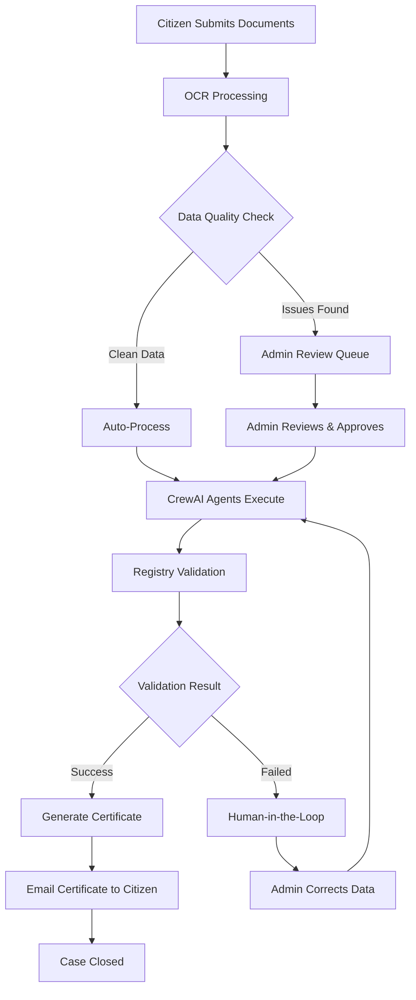

# 🏛️ German Public Administration - Address Change Automation

<div align="center">


**An AI-powered multi-agent system for automating German public administration address change workflows**

*Built in collaboration with [Fraunhofer IESE](https://www.iese.fraunhofer.de/)*

</div>

---

## 📖 Overview

This project automates the complex German address change (_Ummeldung_) process using a **multi-agent AI system**. When citizens move to a new address in Germany, they must notify the local registration office (_Bürgeramt_) within two weeks. This system digitizes and streamlines that process.

### 🎯 Key Features

- **🤖 Multi-Agent Workflow**: Powered by [CrewAI](https://crewai.com) with specialized agents for different tasks
- **📄 Document Processing**: OCR-based extraction from PDFs (address forms, landlord certificates)
- **✅ Smart Validation**: Automatic verification against registry databases
- **🔄 Human-in-the-Loop (HITL)**: Low-confidence cases are flagged for human review
- **📧 Email Notifications**: Automated certificate delivery via SendGrid
- **🌐 Bilingual Support**: German and English interface
- **💬 AI Chatbot**: Integrated assistant for user queries

---

## 🏗️ Architecture

```
┌─────────────────────────────────────────────────────────────────┐
│                        FRONTEND (React + Vite)                   │
│  ┌──────────┐  ┌──────────────┐  ┌─────────┐  ┌──────────────┐  │
│  │User Portal│  │Admin Dashboard│  │ Login  │  │Contact Page  │  │
│  └──────────┘  └──────────────┘  └─────────┘  └──────────────┘  │
└────────────────────────────┬────────────────────────────────────┘
                             │ REST API
┌────────────────────────────▼────────────────────────────────────┐
│                     BACKEND (FastAPI + Python)                   │
│  ┌─────────────┐  ┌──────────────┐  ┌────────────────────────┐  │
│  │  API Layer  │  │ OCR Service  │  │   Email Service        │  │
│  └─────────────┘  └──────────────┘  └────────────────────────┘  │
│                                                                  │
│  ┌───────────────────────────────────────────────────────────┐  │
│  │                    CrewAI Multi-Agent System               │  │
│  │  ┌─────────────┐  ┌────────────────┐  ┌────────────────┐  │  │
│  │  │ Data Agent  │  │Validation Agent│  │ Registry Agent │  │  │
│  │  └─────────────┘  └────────────────┘  └────────────────┘  │  │
│  └───────────────────────────────────────────────────────────┘  │
└────────────────────────────┬────────────────────────────────────┘
                             │
┌────────────────────────────▼────────────────────────────────────┐
│                    DATABASE (PostgreSQL 16)                      │
│         Cases • Audit Logs • Extracted Data • Workflow State     │
└─────────────────────────────────────────────────────────────────┘
```

---

## 🚀 Quick Start

### Prerequisites

- **Docker** & **Docker Compose** (recommended)
- **Python 3.10+** (for local development)
- **Node.js 18+** (for frontend development)

### Environment Setup

1. **Clone the repository**
   ```bash
   git clone https://github.com/aditya153/address-change-automation.git
   cd address-change-automation
   ```

2. **Configure environment variables**
   ```bash
   cd automation
   cp .env.example .env
   ```
   
   Edit `.env` with your API keys:
   ```env
   OPENAI_API_KEY=your_openai_api_key
   SENDGRID_API_KEY=your_sendgrid_api_key
   SENDER_EMAIL=your_verified_sender@email.com
   ```

3. **Start with Docker Compose**
   ```bash
   docker-compose up --build
   ```

4. **Access the application**
   - 🌐 **Frontend**: http://localhost:3000
   - 🔧 **Backend API**: http://localhost:8000
   - 📚 **API Docs**: http://localhost:8000/docs

---

## 🔧 Tech Stack

| Layer | Technologies |
|-------|-------------|
| **Frontend** | React 18, Vite, CSS3 (Glassmorphism) |
| **Backend** | FastAPI, Python 3.10+, Uvicorn |
| **AI/ML** | CrewAI, OpenAI GPT-4, LangChain |
| **Database** | PostgreSQL 16 |
| **OCR** | Document AI / Custom OCR Service |
| **Email** | SendGrid |
| **DevOps** | Docker, Docker Compose |

---

## 📂 Project Structure

```
address_auto_main/
├── automation/
│   ├── src/automation/
│   │   ├── api.py              # FastAPI backend
│   │   ├── crew.py             # CrewAI agent definitions
│   │   ├── db.py               # Database operations
│   │   ├── ocr_service.py      # Document processing
│   │   ├── email_service.py    # SendGrid integration
│   │   ├── chatbot_service.py  # AI chatbot
│   │   ├── config/
│   │   │   ├── agents.yaml     # Agent configurations
│   │   │   └── tasks.yaml      # Task definitions
│   │   └── tools/              # Custom CrewAI tools
│   ├── frontend/
│   │   ├── src/
│   │   │   ├── pages/
│   │   │   │   ├── UserPortal.jsx      # Citizen form
│   │   │   │   ├── AdminDashboard.jsx  # Admin interface
│   │   │   │   ├── Login.jsx           # Authentication
│   │   │   │   └── ContactPage.jsx     # Contact form
│   │   │   └── context/
│   │   │       ├── AuthContext.jsx     # Auth state
│   │   │       └── LanguageContext.jsx # i18n
│   │   └── index.html
│   ├── docker-compose.yml
│   ├── Dockerfile
│   └── requirements.txt
└── README.md
```

---

## 🔄 Workflow



---

## 📡 API Endpoints

| Method | Endpoint | Description |
|--------|----------|-------------|
| `GET` | `/health` | Health check |
| `POST` | `/submit-case` | Submit address change request |
| `GET` | `/admin/pending` | Get cases pending review |
| `GET` | `/admin/processing` | Get cases being processed |
| `GET` | `/admin/completed` | Get completed cases |
| `POST` | `/admin/approve/{case_id}` | Approve a pending case |
| `GET` | `/case/{case_id}` | Get case details |
| `GET` | `/audit-log/{case_id}` | Get case audit trail |

---

## 🎨 User Interface

### User Portal
Citizens can upload their documents (address form + landlord certificate) and submit their address change request.

### Admin Dashboard
Administrators can:
- View pending cases requiring review
- Monitor auto-processing cases
- Approve or reject submissions
- Handle Human-in-the-Loop (HITL) cases
- Track completed cases

---

## 🤝 Contributing

Contributions are welcome! Please feel free to submit a Pull Request.

---

## 📄 License

This project is developed for academic and research purposes in collaboration with Fraunhofer IESE.

---

## 📞 Contact

- **Developer**: Aditya Nirgude
- **GitHub**: [@aditya153](https://github.com/aditya153)
- **Project Repository**: [address-change-automation](https://github.com/aditya153/address-change-automation)

---

<div align="center">

**Built with ❤️ for German Public Administration Digitalization**

*Powered by CrewAI • FastAPI • React*

</div>
